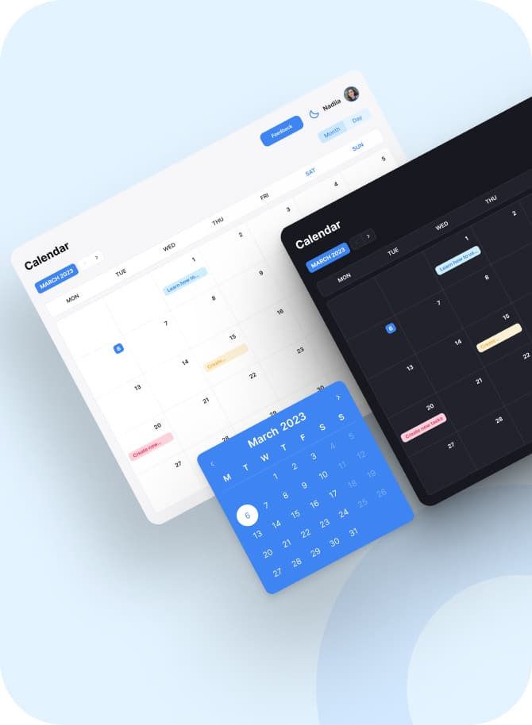
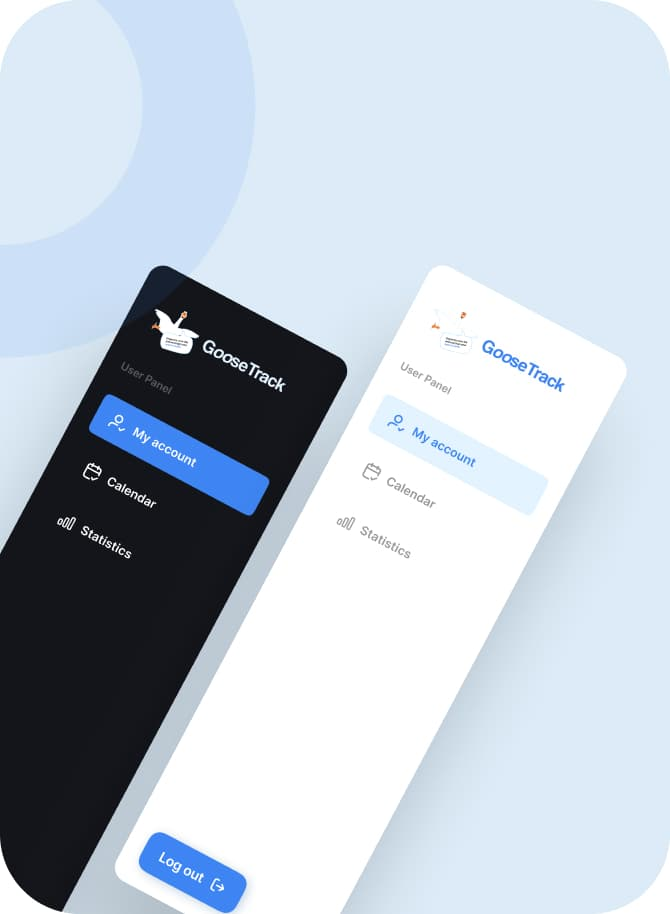
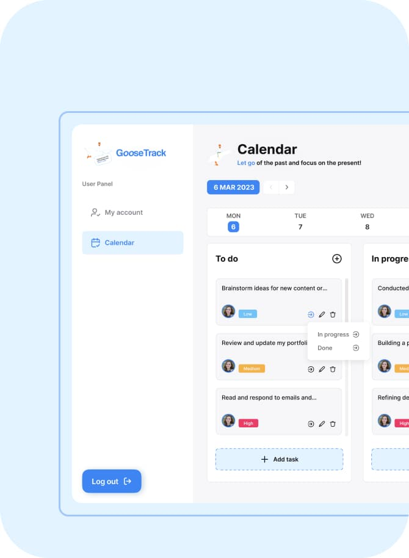

  

<h1 align="center">GooseTrack</h1>

  

<h2 align="center">Calendar View</h2>

  GooseTrack's Calendar view provides a comprehensive overview of your schedule, displaying all your tasks, events, and appointments in a visually appealing and intuitive layout.

  

<h2 align="center">Sidebar</h2>

GooseTrack offers easy access to your account settings, calendar, and filters. The "My Account" section allows you to manage your profile information and preferences, while the calendar provides a quick and convenient way to view your upcoming events and tasks.

  

<h2 align="center">All-In-One</h2>

  GooseTrack is an all-in-one productivity tool that helps you stay on top of your tasks, events, and deadlines. Say goodbye to scattered to-do lists and hello to streamlined productivity with GooseTrack.

  

<h2 align="center">Reviews</h2>

  We value your feedback! Please take a moment to share your thoughts and experiences with GooseTrack. Your reviews help us improve and provide a better service to our users.

  Thank you for choosing <strong>GooseTrack</strong>, and we hope it enhances your productivity and simplifies your schedule.

## Technologies Used

#### React (v18.2.0):

React is a JavaScript library for building user interfaces, enabling you to
create dynamic and highly performant web applications. Your application is built
on React, making it easy to create components and manage application state.

#### Redux Toolkit (v1.9.7):

Redux Toolkit is a library for managing the state of your application in React
projects. It helps organize and simplify state management, centralizing it and
providing debugging tools.

#### Axios (v1.5.1):

Axios is a library for making HTTP requests in your React applications, allowing
you to interact with the server, fetch, and send data.

#### Material-UI (v5.14.6):

Material-UI is a design library for React, offering a set of ready-made
components and styles in the Material Design style. You used Material-UI to
create a stylish and modern user interface.

#### React Router DOM (v6.15.0):

React Router DOM is a library for navigation and routing in React applications,
enabling the creation of routers and page navigation.

#### Yup (v1.3.2):

Yup is a library for data validation in React applications, allowing you to set
validation rules for forms and data, ensuring their correctness.

#### Recharts (v2.8.0):

Recharts is a library for creating charts and diagrams in React. You used it to
display data in the form of interactive charts.

#### React-Redux (v8.1.3):

React-Redux is a library for integrating Redux into your React applications,
simplifying the connection between Redux state and React components.

#### Formik (v2.4.5):

Formik is a library for managing forms in React applications, making form
creation and management more convenient and efficient.

#### React-datepicker (v4.20.0):

react-datepicker is a library for adding date picker functionality to your React
forms. It simplifies date selection for users and enhances the user experience
when working with dates.

# Meet Our Team

Here are the talented individuals who contributed to the development of
GooseTracks:

### Team Lead

1. [Hennadii Samofal](https://github.com/Cosmits)

### Scram Master

1. [Daryna Merkulova](https://github.com/DarinaMerkulova)

### Development Team

1. [Bohdan Kireev](https://github.com/Acidhouzee)
2. [Gabriella Marusyak](https://github.com/GabriellaMar)
3. [Illia Shatokhin](https://github.com/Illia-Shatokhin)
4. [Kateryna Kharkova](https://github.com/KaterinaKha)
5. [Maryna Khmarska](https://github.com/myhappyday)
6. [Ruslana Onyshchuk](https://github.com/Ruslaana)
7. [Serhii Podhornyi](https://github.com/SerJ1327)
8. [Volodymyr Kozlovskyi](https://github.com/VolodymyrKoz)
9. [Yuliia Balabukha](https://github.com/julie08ua)
